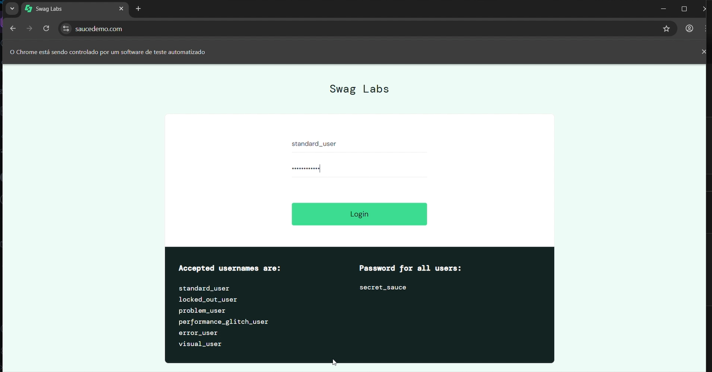
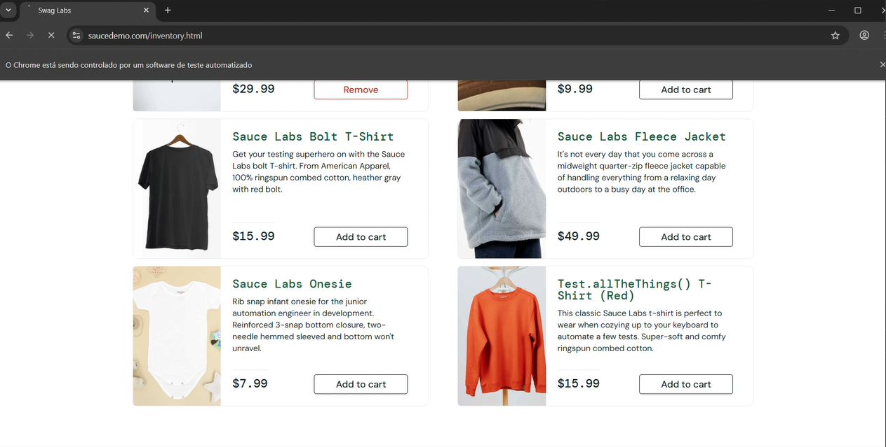
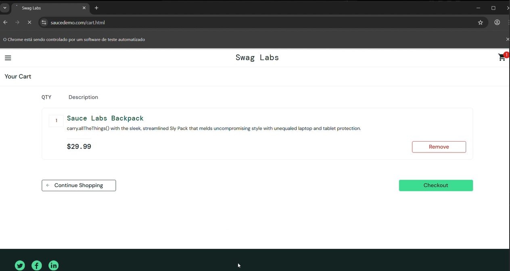
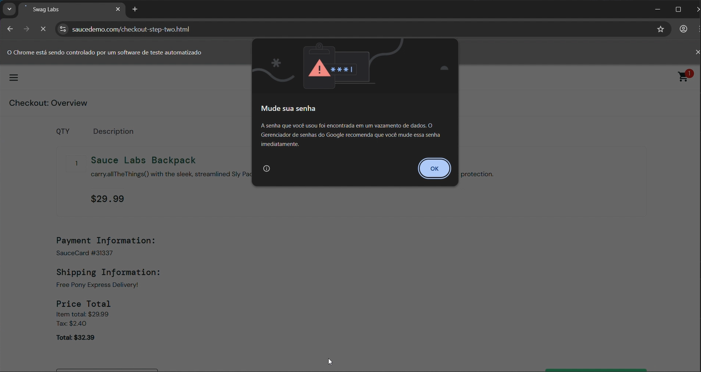
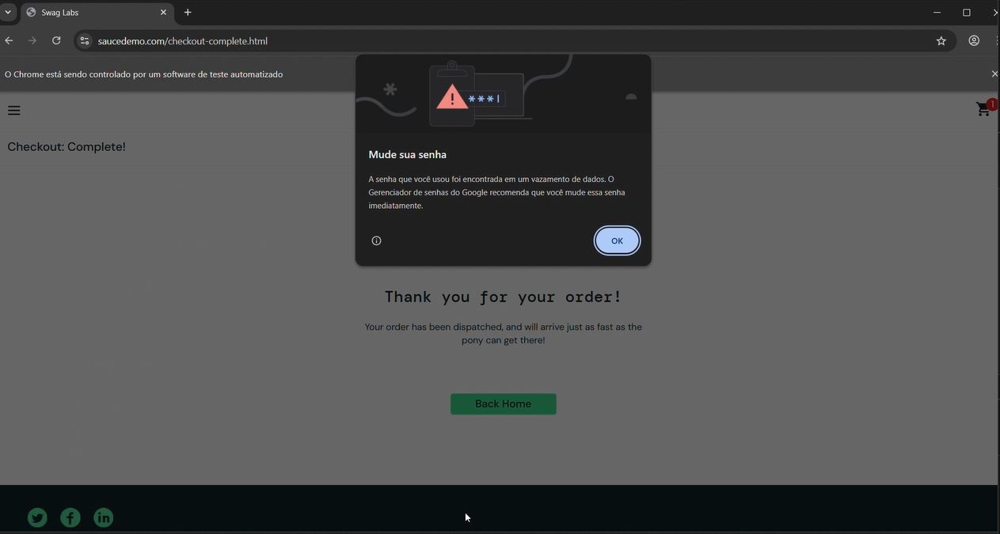

# QA Automation Project

Projeto de automação de testes para API e Web com integração contínua (CI/CD).

```markdown
# qa-automation-project

Projeto de automação de testes cobrindo API REST e fluxo Web E2E, com execução automática via GitHub Actions.


---

## Tecnologias

| Camada | Tecnologia |
|---|---|
| Linguagem | Python 3.10 |
| Testes | pytest |
| Automação Web | Selenium 4 |
| Gerenciamento de driver | webdriver-manager |
| Testes de API | requests |
| CI/CD | GitHub Actions |

---
## Instalação

**Pré-requisitos:** Python 3.10+ e Google Chrome instalados.

```bash
git clone https://github.com/nicolass200/qa-automation-project.git
cd qa-automation-project

python -m venv venv
source venv/bin/activate        # Linux/Mac
venv\Scripts\activate           # Windows

pip install -r requirements.txt
```

---

## Execução

```bash
# Todos os testes
PYTHONPATH=. pytest

# Apenas API
PYTHONPATH=. pytest api_tests -v

# Apenas Web
PYTHONPATH=. pytest web_tests -v
```

---

## Cobertura de Testes

### API — Swagger Petstore

Base URL: `https://petstore.swagger.io/v2`

| Módulo | Cenário | Tipo |
|---|---|---|
| User | Criar, buscar e deletar usuário | Positivo |
| User | Buscar usuário inexistente | Negativo |
| Pet | Criar, atualizar e buscar pet | Positivo |
| Pet | Buscar pet inexistente | Negativo |
| Store | Criar, buscar e deletar pedido | Positivo |
| Store | Buscar pedido inexistente | Negativo |

### Web — SauceDemo

URL: `https://www.saucedemo.com/`

```
Login → Adicionar produto → Carrinho → Checkout → Confirmação
```

---

## Arquitetura Web

Padrão **Page Object Model (POM)** — cada página encapsula seus elementos e ações.

```
BasePage          → lógica de espera e interação reutilizável
├── LoginPage     → autenticação
├── InventoryPage → seleção de produtos
├── CartPage      → revisão do carrinho
└── CheckoutPage  → preenchimento de dados e finalização
```

---

## CI/CD

Pipeline executa automaticamente a cada `push` ou `pull request`:

1. Setup do Python 3.10
2. Instalação das dependências
3. Execução dos testes de API
4. Execução dos testes Web (Chrome headless)
5. Upload do screenshot em caso de falha

## Prints
### Prints das telas
### Tela de login


### Tela de produtos após login


### Carrinho com produto adicionado

### Tela de checkout com preenchimento dos dados


### checkout da compra


### Confirmação de compra
